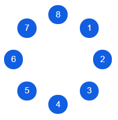

# \<RadialRender />

### Render React components in a circle
<br />

## Requirements
**React 16.8.1**
<br />
<br />

## Install

```bash
npm i react-radial-render
```
<br />

## Basic Usage

Import the <code>RadialRender</code> component:

``` javascript
import RadialRender from "react-radial-render";
```

Pass an array of components to render and r as the radius:

```jsx
<RadialRender
  r={70}
  components={[
    <CircleBnt>1</CircleBnt>,
    <CircleBnt>2</CircleBnt>,
    <CircleBnt>3</CircleBnt>,
    <CircleBnt>4</CircleBnt>,
    <CircleBnt>5</CircleBnt>,
    <CircleBnt>6</CircleBnt>,
    <CircleBnt>7</CircleBnt>,
    <CircleBnt>8</CircleBnt>
  ]}
/>
```

Components will render clockwise starting from the top right

### Result:

The components will be rendered along the radius at the center point of each component.



<br />

## Props

### r

```javascript
r: PropTypes.number.isRequired
```

The radius to render all components in a circle. Components will be rendered at their centerpoint along the radius.

### components

```javascript
components: PropTypes.array.isRequired
```

An array of components to render. The qty of points rendered along the arc is controlled by the lenght of the array.

### genKey()

```javascript
genKey: PropTypes.func
```

A function for generating your own unique keys for components. The default is <code>radial-render-[i]</code> where <code>[i]</code> is the index of the component. This prop should be used especially when using the <code>RadialRender</code> component multiple times in an application.

### width

```javascript
width: PropTypes.number
```

The width of the containing div in the <code>RadialRender</code> component.

### height

```javascript
height: PropTypes.number
```

The height of the containing div in the <code>RadialRender</code> component.
